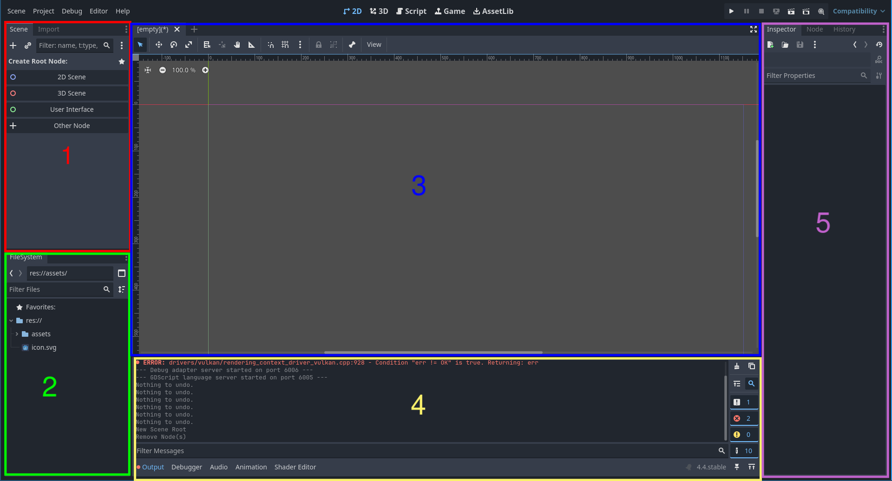
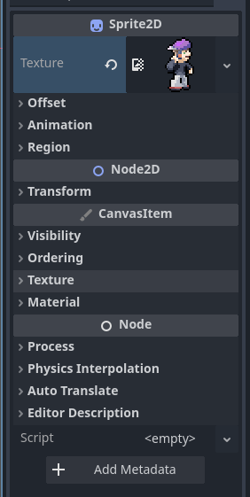
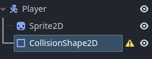
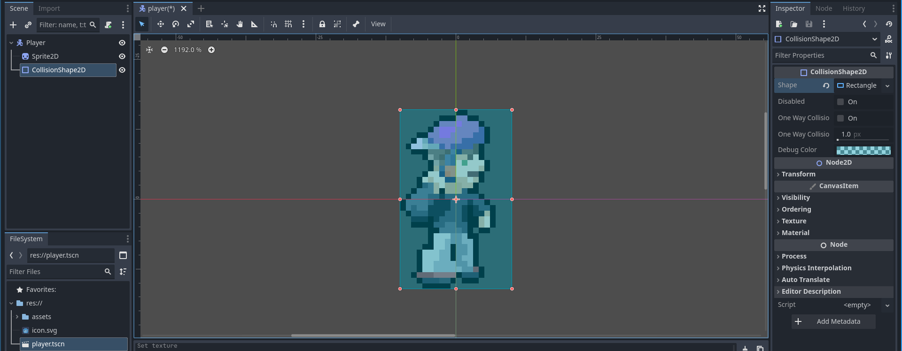
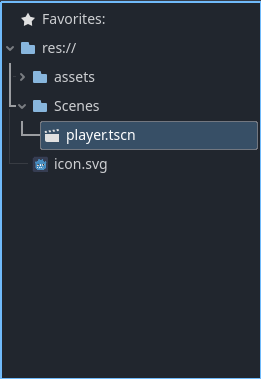

# Character movement

In this section, we will make a player scene with a hitbox and sprite. We will also add a movement script to our player.

---

### Before we get into the programming, lets review the parts of the Godot Editor

1) Scene Dock: Here you can manage the active scene's nodes
2) Filesystem: Your project's files and assets 
3) Workspace: Visually manage the scene, drag, resize, rotate
4) Output: See logging and debugging info 
5) Inspector: Edit properties of the selected object

Scenes are compartments that keep relevant nodes and scenes to that scene. For example, a scene called StageOne will will hold nodes for the first level, and a scene called Player will hold nodes player's hitboxes and animations. Scenes can encapsulate other scenes!
Nodes are the building blocks to your scenes, and thus, your game. They can fulfill everything you need: collision, animation, user-controlled bodies, UI, etc. Nodes can be attached to other nodes in a 'parent-child' hierarchy, creating a relationship known as a tree. The top-most node is known as the 'root node'.

## Player Setup
1) From the Scene Dock, create the new player scene by pressing `Other Node` and add a `CharacterBody2D` node to the current scenes
    - A `ChracterBody2D` node is used for implementing moving objects, since this is the first node in this scene, it will automatically become the root node
2) Double click on this newly created node and rename it to player
    - Always rename your root nodes as soon as possible to keep everything neat!
3) Right click on the root player node and add a 'Sprite2D' node as a child of it. 
 
4) From the asset file in the Filesystem, drag the `idle c.png` into the `Texture` field of the `Sprite2D` in the Inspector.

5) Now, we need a hitbox for our player. Add a `CollisionShape2d` as a child of the player node. 

6) The `CollisionShape2d` still doesn't have a shape yet. In the inspector, select the shape field dropdown and select `New RectangleShape2D`. Then resize the blue rectangle in the Scene Dock ot fit the player sprite.

Now, save these scene as PLayer.tscn with `Control + S` or from the `Scene` tab from the top-leftmost bar. You should create a scenes folder for better organization.

You have made a basic player scene! See how you add different nodes to a parent achieve different purposes like hitboxes or sprites? This is called 'Composition' and is used commonly used in godot to build modular and reusable game objects. 

Excrept from [gotut.net](https://www.gotut.net/composition-in-godot-4/): **Composition is a design principle that involves creating complex objects by combining simpler, reusable components. Using components has the following advantages:**

- Reusability: Components can be reused across different parts of the game.
- Modularity: Components are independent, allowing you to mix and match them as needed.
- Flexibility: Components can be easily replaced or extended without affecting the rest of the system.
- Consistency: Changes to a component automatically apply to all objects that use it, ensuring uniform behavior across your game.

---

## Character movement
So far, we've been telling you exactly what to do and how to do it. Now though, you're going to have to do a little more thinkng. We'll provide basic guidelines and simple examples for the next steps, but you'll need to write most of the code yourself.

> To be continued..
