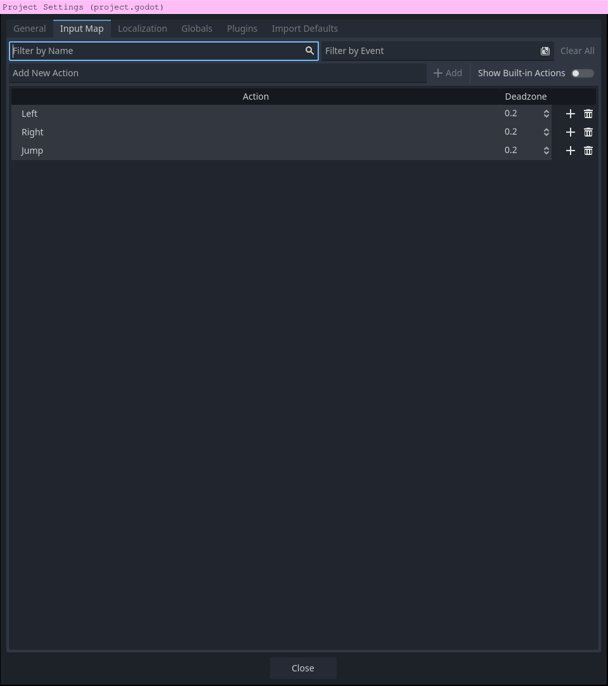
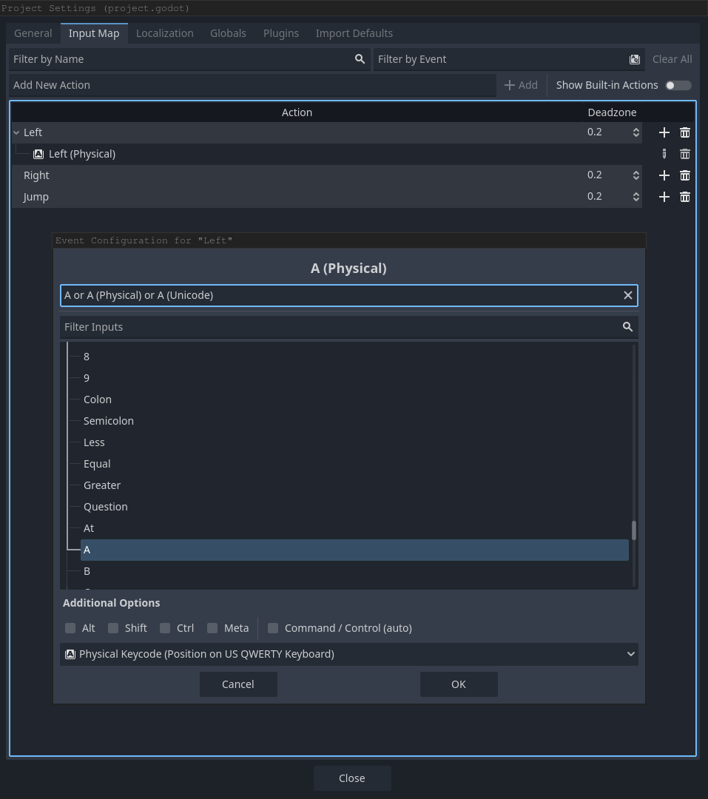

# Improving our player

Right now, our player can walk left and right and can also fall off a cliff! However, we can't jump off the cliff, so lets fix that.

## Using an Input Map

Before we add jumping, lets improve how our script detects inputs. Navigate to the project settings from the project button on the top left of the godot toolbar. Go to the "Input Map" tab.    

> With an input map, you can create actions that are triggered by a set of events. Events can be mouse clicks, keyboard presses, conroller pressses, etc. An action can have multiple events that trigger it. You can see the status of these actions with the built in `Input` global, for example: `Input.is_action_pressed("<your_event>")`.

Remember how in your player movement script you called `Input.is_action_pressed("ui_right")` to detect the action of the player pressing the right arrow key? We did that earlier for simplicity, but it's best practice to make your own input map with your own actions and respective inputs. You can add one action and make multiple events trigger it, like making the right arrow key and `a` both trigger the move right event. Go ahead and add 3 actions named `Left`, `Right`, and `Jump`. Type the action name then press the add button right next to it. 

 


Now you can add events-i.e. mouse and keyboard actions- to each respective input. Press the `+` icon next to each of your new actions then a UI will appear where you can select the event you want to trigger that action. Go ahead and add whatever inputs you see fit for each event.    

 


### Updating our movement script

Now that you have your own input map, you no longer have to use the default `ui_right` and `ui_left`. Update the left and right movement to instead use your custom `Right` and `Left` events.


## Finally, adding jumping

Add an extra if clause to your script that triggers when the player triggers the `Jump` action. Instead of using `Input.is_action_pressed("Jump")`, use `Input.is_action_just_pressed("Jump")` so that player can't spam jump by holding down the jump key. Also, the player should only be able to jump when they are on the floor, which the `CharacterBody2D` function, `is_on_floor()` will inform you of. Your script should add a certain constant amount of jump power to `velocity.y`. This constant should be declared at the start of your script. It should also be a negative number. Go ahead and make the additions to your script, we will give you the final script, but try coding it yourself!


Your script should look something like this now:

```gdscript
extends CharacterBody2D

const SPEED: int = 200 
const JUMP_POWER: int = -300 # You can play around with this value if you want.

var x_direction: int = 0

# Called when the node enters the scene tree for the first time.
func _ready() -> void:
	pass # Replace with function body.

func _physics_process(delta: float) -> void:
	if not is_on_floor():
		velocity += get_gravity() * delta
	
	if Input.is_action_just_pressed("Jump") and is_on_floor():
		velocity.y += JUMP_POWER # Add the jump power
	
	if Input.is_action_pressed("Left"):
		x_direction = -1
	elif Input.is_action_pressed("Right"):
		x_direction = 1
	else:
		x_direction = 0
	
	velocity.x = x_direction * SPEED

	move_and_slide()
```


## Adjusting camera

The player looks a little small, so lets fix that by adjusting the zoom. Go to your `world.tscn` scene and, in the scene tree, select your camera. Now go to the inspector and adjust the zoom property. Set it to 2. The camera also follows the player closely and feels very rigid. We can fix this by also enabling "Position Smoothing" for the camera in the inspector.   


---

Now our player can hop around and parkour around the scene, but its just a static image! In the [next section](./section-4.md) we wil add movement animations.
