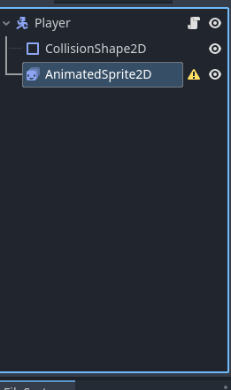
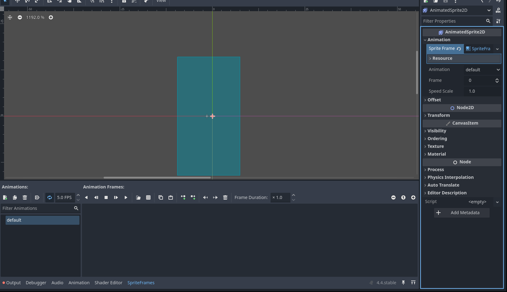
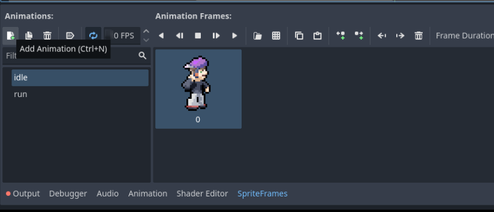

# Character Animations

Our character is a still image right now, so lets add some dynamic animations to make them feel more alive! This animations will respond to their direction and status.

---

## Adding the SpriteFrames

1) Navigate to the player scene and replace the `Sprite2D` with an `AnimatedSprite2D`     
 

2) Select the `AnimatedSprite2D` and, in the inspector, select the "Animation" dropdown. Click on the empty sprite frames box and select "New SpriteFrames".     

 

3) Click on the sprite frames box again and a "SpriteFrames" tab on the bottom toolbar should appear.



## Creating the animations

1) Lets make the running animation first. Click on the folder icon on the SpriteFrame dock and select and open the images `run1.png` to `run4.png`. You can play around with the FPS values. Press play to see a preview of the animation in the scene dock.     

 

2) Double click on the "default" and rename it to "run".

3) Our character also needs an idle animation, so create a new animation named "idle" and import just `idle c.png`. Set the FPS of this animation to 0 since it's just one frame.

 

4) Now repeat for the jump and fall animation. Both of these will be one sprite. You can use `fall.png` for the fall sprite and `attack.png` as the fall sprite. You can play with these values if you'd like. Remember to set the FPS to 0 if it's just one frame though.    


Right now, the animations are juts sitting there. It's time to code these animations into the player movement script. Head back to `player.gd`.

> Remember to save throughout this guide! (control-s)

## Programming the animations

To play an animation, you can use the code `$AnimatedSprite2D.play("animation_name")`. Also, to flip the sprite horizontally, you can use the code `$AnimatedSprite2D.flip_h = true` to set that property of the `AnimatedSprite2D` to true. You can set it to false to flip it back.

> '$' in godot is use to access a particular child node based on it's name. When you type `$AnimatedSprite2D`, Godot will search the `Player`'s child nodes and return your `AnimatedSprite2D` node. If it's not found, it will return null and error out if you try to dereference it (meaning call any of it's functions, access it's data, yadayada). Alternatively, you can use get_node(name: String)

You can try implementing the script right now if you are comfortable, but we will give you some hints about what your script should do and later on the actual script. We recommend trying to program it as independently as possible though! 

> Try debugging and playtesting the script yourself!

Your script should:
    - When the player presses the left action, flip the sprite
    - When the player presses the right action, unflip the sprite
    - If `x_direction` is not 0 and the player is on the floor, play `run`
    - If the player isn't on the floor and the `velocity.y` is negative (player is going up), play the jump animation
    - If the player isn't on the floor and the `velocity.y` is positive (player is going down), play the fall animations


Your script should look something like this now:
```gdscript
extends CharacterBody2D

const SPEED: int = 200 
const JUMP_POWER: int = -300

var x_direction: int = 0

# Called when the node enters the scene tree for the first time.
func _ready() -> void:
	pass # Replace with function body.

func _physics_process(delta: float) -> void:
	if not is_on_floor():
		velocity += get_gravity() * delta
	
	if Input.is_action_just_pressed("Jump") and is_on_floor():
		velocity.y += JUMP_POWER
	
	if Input.is_action_pressed("Left"):
		x_direction = -1
		$AnimatedSprite2D.flip_h = true
	elif Input.is_action_pressed("Right"):
		x_direction = 1
		$AnimatedSprite2D.flip_h = false
	else:
		x_direction = 0
	
	velocity.x = x_direction * SPEED
	
	# Play animations
	if is_on_floor():
		if x_direction != 0:
			$AnimatedSprite2D.play("run")
		else:
			$AnimatedSprite2D.play("idle")
	else:
		if velocity.y > 0:
			$AnimatedSprite2D.play("fall")
		if velocity.y < 0:
			$AnimatedSprite2D.play("jump")

	move_and_slide()
```
> If it doesn't look exactly like this but achieves the same thing, that's fine!

---

Nice! The game functions as a pretty basic platformer now. But you endlessly fall off the edge without the game restarting and there are no enemies. Lets make ways to kill your player in the [next section](./section-5.md).
