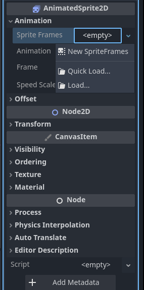
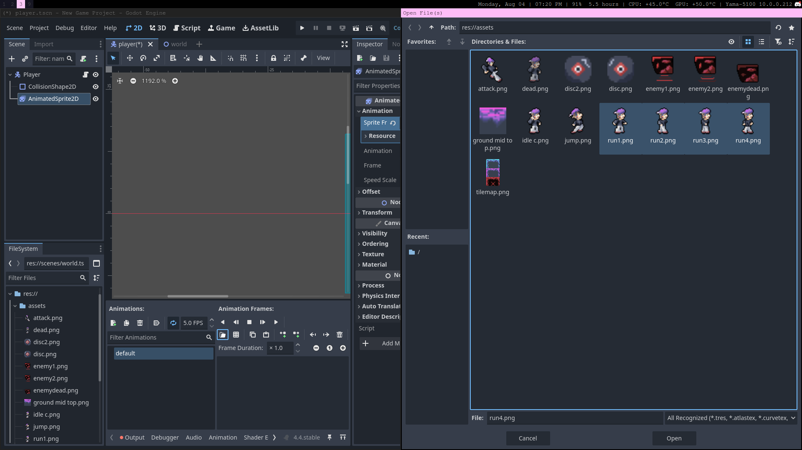
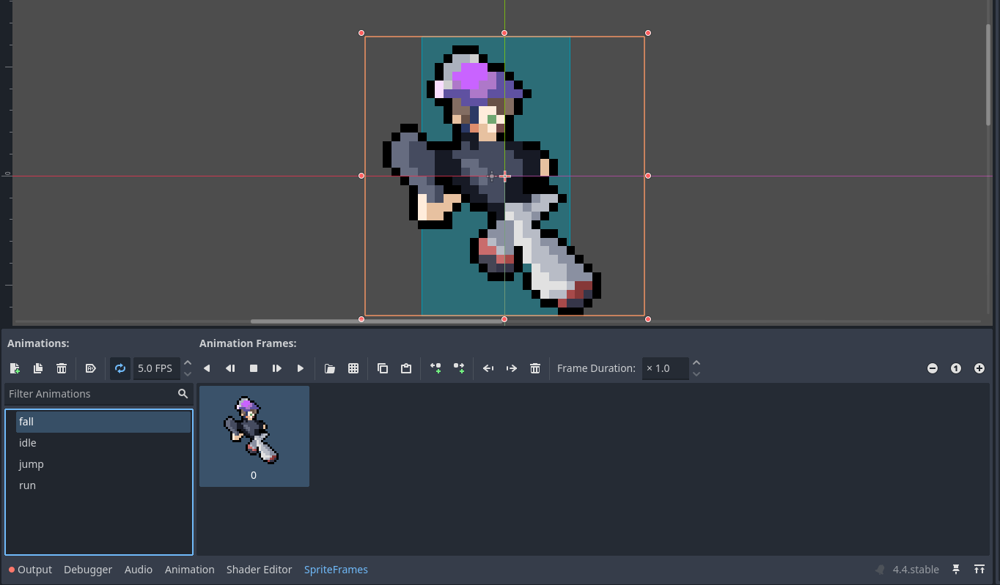

# Character Animations

Our character is a still image right now, so lets add some dynamic animations to make them feel more alive! This animations will respond to their direction and status.

---

## Adding the SpriteFrames

1) Navigate to the player scene and replace the `Sprite2D` with an `AnimatedSprite2D`     
 

2) Select the `AnimatedSprite2D` and, in the inspector, select the "Animation" dropdown. Click on the empty sprite frames box and select "New SpriteFrames".     

 

3) Click on the sprite frames box again and a "SpriteFrames" tab on the bottom toolbar should appear.

## Creating the animations

1) Lets make the running animation first. Click on the folder icon on the SpriteFrame dock and select and open the images `run1.png` to `run4.png`. You can play around with the FPS values. Press play to see a preview of the animation in the scene dock.     

 

2) Double click on the "default" and rename it to "run".

3) Our character also needs an idle animation, so create a new animation named "idle" and import just `idle c.png`. Set the FPS of this animation to 0 since it's just one frame.

 

4) Now repeat for the jump and fall animation. Both of these will be one sprite. You can use `fall.png` for the fall sprite and `attack.png` as the fall sprite. You can play with these values if you'd like. Remember to set the FPS to 0 if it's just one frame though.    

Right now, the animations are juts sitting there. It's time to code these animations into the player movement script. Head back to `player.gd`.

> Remember to save throughout this guide! (control-s)

## Programming the animations

To play an animation, you can use the code `$AnimatedSprite2D.play("animation_name")`. 

> '$' in godot is use to access a particular child node based on it's name. When you type `$AnimatedSprite2D`, Godot will search the `Player`'s child nodes and return your `AnimatedSprite2D` node. If it's not found, it will return null and error out if you try to dereference it (meaning call any of it's functions, access it's data, yadayada).

> To be continued...
