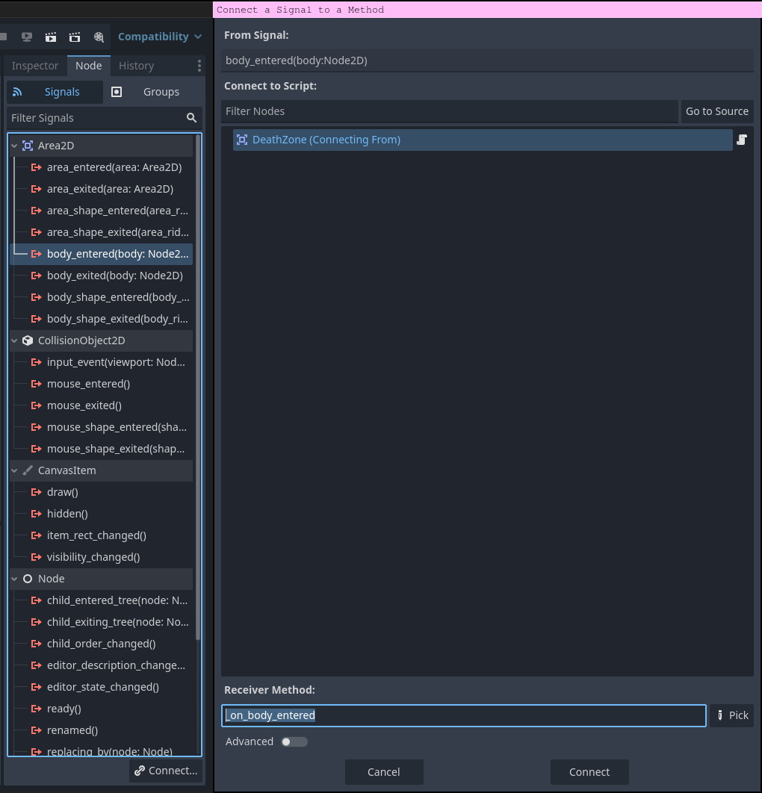
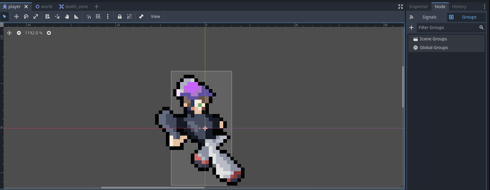
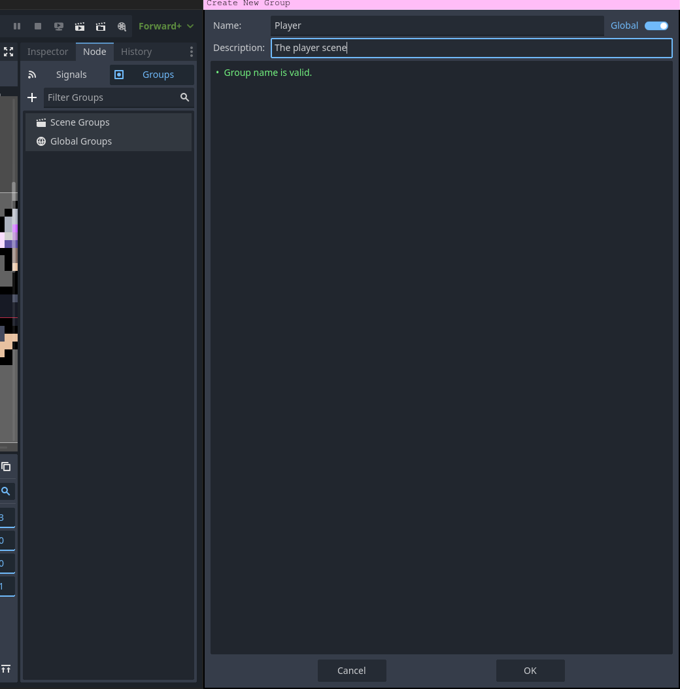
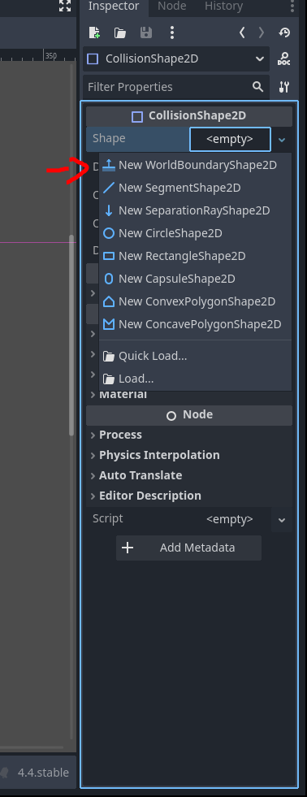
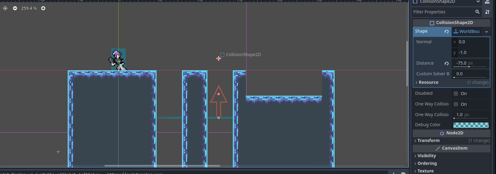

# Killing the player

In this section, we will add ways for our player to die, instead of falling into an endless grey void.

## Creating a death zone

We are gonna create a zone that kills the player immedietely upon entering. Any future scene that kills the player when they enter any area will use this scene.

1) Create a new scene with the root node as a `Area2D` and rename it to "DeathZone". Save it inside your scenes folder.

2) Attach a new script to the node. Make sure to put this script in your `scripts` folder.

 

3) Select the `DeathZone` node and navigate to the node page on the inspector.


> Here you can see the different signals the `Area2D` node has. Signals in godot are just another way for nodes to communicate with each other in a modular way.  They are basically messages that nodes emit when something happens, like something entering the `Area2D`'s collision area. Other nodes can attach to these signals and run code when they are emited. 

4) Double click on the signal `body_entered()` so we can check when a player enters the death zone, then connect it to your script by pressing "Connect".




Now, lets look at what changed in your newly created script.

```gdscript
extends Area2D


# Called when the node enters the scene tree for the first time.
func _ready() -> void:
	pass # Replace with function body.


# Called every frame. 'delta' is the elapsed time since the previous frame.
func _process(delta: float) -> void:
	pass


func _on_body_entered(body: Node2D) -> void:
	pass # Replace with function body.

```
The `on_body_entered(body: Node2D) -> void` function will be called whenever any body enters the death zone. However, we don't know for sure if this body is a player. If later on we add more bodies to our game, how will we differentiate between the player and other bodies? We can do this with groups.

> A body in godot is a physical object that interacts with the physics engine, like the `CharacterBody2D` on your player. Areas are zones in your game used for non-physcal interactions, like a player entering a zone that triggers their death.

1) Go into the player scene and, where the inspector is, go into the "Node" tab. Then navigate to the "Groups" area.



2) Create a new global group called "Player" and add our player scene to it.




Now, any other node can call `body.is_in_group("Player")` to check if the body is the player! Return to the `DeathZone` scene's script and, if the body entered is a player, call `.die()` on it (we will write this later). You can delete the `_ready()` and `process()` functions. 

This is how your death zone script should look like:
```gdscript
extends Area2D

func _on_body_entered(body: Node2D) -> void:
	if body.is_in_group("Player"):
        body.die()
```

## Adding a death boundary to our world scene

1) Go to the world scene and add your `DeathZone` node you made earlier to it. Add a `CollishionShape2D` as a child of it.

 

> We didn't add a collision shape to the `DeathZone` scene so that, whenever another scene wants to create a death zone, they can add whatever shape they want.

2) Select the `CollisionShape2D` and navigate to the inspector. On the "shape" property drop down, create a new "WorldBoundaryShape2D".

 

3) Drag the boundary somewhere under the platform objects to where the player will only touch it if they fall off.

 

> This world boundary will stretch out to the entire level.

Now, lets actually write the `die()` function for our player.

## Killing the player

Return to your player script and create the `die()` function. This function should:
- Set the player's `velocity` to a zero vector
    - Remember that the `velocity` is of type Vector2, and so you must use the constructor `Vector2(x, y)` to create a new `Vector2`s. You can also use the constant `Vector2.ZERO` to get a vector with values `(0, 0)`.
- Lock the ability to move
    - You can add a `bool` variable to the top of your script that is set to true when the player dies. In the main physics loop, return early if this variable is set to true.
- Disable the players hitbox
    - You can do this by refereing to the `CollisionShape2D` node on the player with `$CollisionShape2D` and setting the `disabled` property to true. You should do this with the function `$CollisionShape2D.set_deferred("disabled", true)`. You have to do it this way as messing with node properties in the middle of physics calculations can cause problems, and by calling it deferred, you are telling the engine to hold off on doing it till the end of the current frame.
- Flip the characters sprite vertically
    - Remember from the earlier section, you can set the `flip_v` property of the `AnimationPlayer2D` to true.
- Delay for a bit, then restart the scene
    - Use `get_tree().change_scene_to_file("path/to/scene")` with the path to your `world.tscn`. This will simply restart the world scene.
    - Use `await get_tree().create_timer(seconds: float).timeout` to delay before changing the scene. You can play around with the amount of time it delays.

> When you call `await get_tree().create_timer(seconds).timeout`, it's creating a timer on the scene tree, then waiting till that timer emmits the signal `timeout`.

Try making and testing the script yourself! 


Heres how your script should look like:
```gdscript
extends CharacterBody2D

const SPEED: int = 200 
const JUMP_POWER: int = -300
const DELAY_TILL_RESTART: float = 1

var is_dead: bool = false
var x_direction: int = 0


# Called when the node enters the scene tree for the first time.
func _ready() -> void:
	pass # Replace with function body.

func _physics_process(delta: float) -> void:
	if not is_on_floor():
		velocity += get_gravity() * delta
	
	if is_dead: # Lets return after the gravity clause so we can watch our player fall off the edge
		move_and_slide() # We must still call move_and_slide() so our player actually falls
		return
		
	if Input.is_action_just_pressed("Jump") and is_on_floor():
		velocity.y += JUMP_POWER
	
	if Input.is_action_pressed("Left"):
		x_direction = -1
		$AnimatedSprite2D.flip_h = true
	elif Input.is_action_pressed("Right"):
		x_direction = 1
		$AnimatedSprite2D.flip_h = false
	else:
		x_direction = 0
	
	velocity.x = x_direction * SPEED
	
	# Play animations
	if is_on_floor():
		if x_direction != 0:
			$AnimatedSprite2D.play("run")
		else:
			$AnimatedSprite2D.play("idle")
	else:
		if velocity.y > 0:
			$AnimatedSprite2D.play("fall")
		if velocity.y < 0:
			$AnimatedSprite2D.play("jump")

	move_and_slide()

func die() -> void:
	is_dead = true
	set_deferred("velocity", Vector2.ZERO)
	$AnimatedSprite2D.flip_v = true
	$CollisionShape2D.set_deferred("disabled", true)
	
	await get_tree().create_timer(DELAY_TILL_RESTART).timeout
	
	get_tree().change_scene_to_file("res://scenes/world.tscn")
```

Now when your player falls off the edge, they should turn upside down and fall off the edge. The game should then eventually restart. But it's awkward how fast the player falls. Lets slow down the game a little when the player dies. We can set `Engine.time_scale` to slow down or speed the game. Any value between 0-1 will slow down the game. You can edit your `die()` function lie this:
```gdscript
const DELAY_TILL_RESTART: float = 2 # You will have to double this from what you had earlier

func die() -> void:
	is_dead = true
	set_deferred("velocity", Vector2.ZERO)
	$AnimatedSprite2D.flip_v = true
	$CollisionShape2D.set_deferred("disabled", true)
	
	Engine.time_scale = 0.5
	await get_tree().create_timer(DELAY_TILL_RESTART).timeout
	Engine.time_scale = 1
	get_tree().change_scene_to_file("res://scenes/world.tscn")
```

> If you slow down the game, all timers will slowdown too! You will have to double your time if you are slowing the game by half.

---

Now, your player should have a die animation when they fall off the edge. This is looking more like a platformer! But there aren't any enemies to get past! We will add some in the [next section](./section-6.md).
